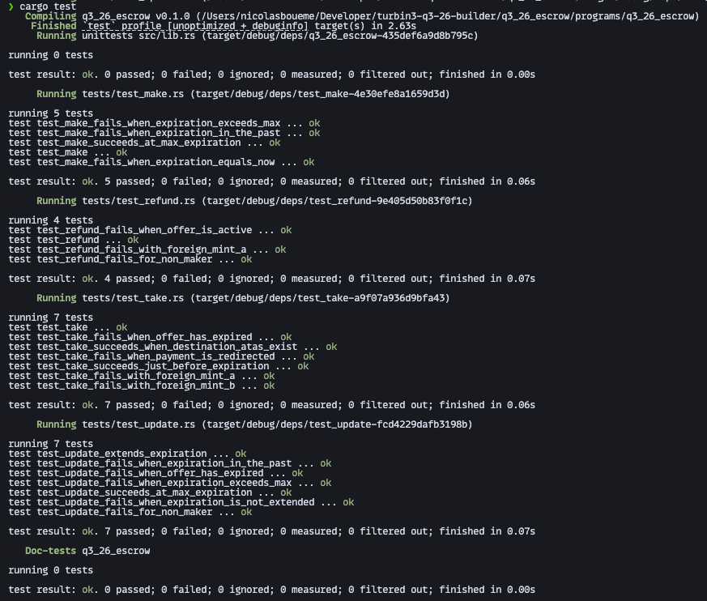

# Q3-26 Escrow

An Anchor program for trustless, expiring token swaps. A maker locks token A in a vault and names the amount of token B they want for it; anyone who pays that price takes the trade atomically, and if nobody does before the deadline the maker takes their tokens back. The vault is an ATA owned by the escrow PDA, so between `make` and settlement neither party can touch the deposit. Built for the Turbin3 Q3 2026 Builder cohort.

Lifecycle: `make` → `update` → `take` **or** `refund`

## Instructions

| Instruction | Args                                                          | Effect                                                                             |
| ----------- | ------------------------------------------------------------- | ---------------------------------------------------------------------------------- |
| `make`      | `id: u64`, `deposit: u64`, `token_b_wanted_amount: u64`, `expiration: i64` | Creates `Escrow` and the vault, then moves `deposit` of mint A into the vault |
| `take`      | —                                                             | Pays the maker `token_b_wanted_amount` of mint B, drains the vault to the taker, closes both accounts |
| `refund`    | —                                                             | After expiry, returns the vault to the maker and closes both accounts              |
| `update`    | `expiration: i64`                                             | Extends a live offer's deadline                                                    |

`update` is optional and may be called any number of times while the offer is live.

## Accounts

| Account  | Seeds / derivation           | Type                                 |
| -------- | ---------------------------- | ------------------------------------ |
| `escrow` | `[b"escrow", maker, id_le]`  | `Escrow` (1 + 121 bytes)             |
| `vault`  | ATA of `mint_a` for `escrow` | `InterfaceAccount<TokenAccount>`     |

`Escrow` stores `id`, `maker`, `mint_a`, `mint_b`, `token_b_wanted_amount`, `bump` and `expiration`. The `id` in the seeds lets one maker run many concurrent offers; every later instruction re-derives the PDA from the stored bump rather than trusting one from the client. A one-byte discriminator (`#[account(discriminator = 1)]`) keeps the account at 122 bytes.

## Errors

| Code | Name                     | Raised when                                                            |
| ---- | ------------------------ | ---------------------------------------------------------------------- |
| 6000 | `ExpirationInThePast`    | `make` or `update` is given a deadline at or before the current slot time |
| 6001 | `ExpirationNotExtended`  | `update` is given a deadline no later than the current one             |
| 6002 | `ExpirationTooFar`       | The deadline is more than `MAX_ESCROW_DURATION` (30 days) out          |
| 6003 | `InvalidAmount`          | `deposit` or `token_b_wanted_amount` is zero                           |
| 6004 | `OfferExpired`           | `take` or `update` is called at or after the deadline                  |
| 6005 | `OfferIsActive`          | `refund` is called before the deadline                                 |

## Design notes

- **Only the program can release the deposit.** The vault's authority is the escrow PDA, which has no keypair; `take` and `refund` sign the outgoing `transfer_checked` and `close_account` with `[b"escrow", maker, id, bump]`.
- **`take` and `refund` are mutually exclusive by construction.** `take` requires `now < expiration` and `refund` requires `now >= expiration`, so exactly one settlement path is open at any instant and the escrow can only be settled once — whichever runs closes the escrow and the vault in the same transaction.
- **The offer's terms are pinned to the account, not the caller.** `has_one = maker`, `has_one = mint_a` and `has_one = mint_b` make Anchor reject any attempt to settle with a substituted party or a cheaper mint; the price and the two mints come from the escrow the maker wrote, never from the taker's account list.
- **Nothing is transferred unilaterally.** `take` performs both legs of the swap in one instruction, so the taker's payment and the vault's release either both land or both revert.
- **The deadline can be extended, never rewound.** `update` requires the offer to still be live, the new deadline to be strictly later than the old one, and the result to stay inside the 30-day cap — so a maker cannot resurrect an expired offer or shorten one out from under a taker mid-transaction.
- **Rent goes back to whoever paid it.** `close = maker` on the escrow and the `close_account` CPI on the vault return both rents to the maker on either settlement path, leaving no dust accounts behind.

## Build & test

```bash
anchor build   # required: the tests load target/deploy/q3_26_escrow.so
cargo test
```



23 tests across the four instructions, covering the success path and every guard — expiry boundaries on both sides, foreign-mint substitution, redirected payment, and non-maker callers. They run in-process on [LiteSVM](https://github.com/LiteSVM/litesvm) — no validator, no devnet, no airdrops — so the suite is fast and hermetic. Add `-- --nocapture` to see compute units for `make` and `take`.

Built with Anchor 1.2.0.

---

Reasoning log for the assignment: [APPROACH.md](APPROACH.md).
